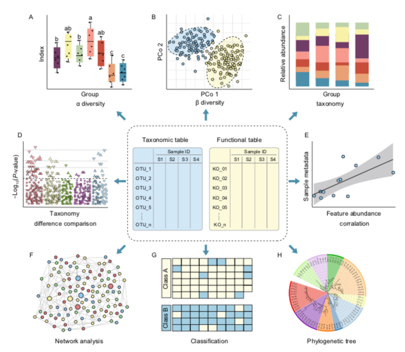

```{r message=FALSE, warning=FALSE, cache=FALSE, load_refs, echo=FALSE}
library(RefManageR)
knitr::opts_chunk$set(comment=NA)
BibOptions(check.entries = FALSE, 
           bib.style = "authoryear", 
           cite.style = 'authoryear', 
           style = "markdown",
           hyperlink = FALSE, 
           dashed = FALSE)
myBib <- ReadBib("assets/example.bib", check = FALSE)
```


class: title-slide
background-image: url("assets/MU_welcomecountry.jpg")
background-position: 100% 50%
background-size: 100% 100%

# .text-shadow[.black[Welcome]]


---

## Outline `r icon::fa("download",pull = "right")`

**Workshops and tutorials on microbiome and genomics**

Today we will be doing through some microbiome bioinformatics.

Workshop notes and data available:

GitHub code repository [`r icon::fa("github")` `siobhon-egan/BIO514`](http://github.com/siobhon-egan/BIO514)          
Website with information & tutorials [`r icon::fa("link")` `siobhonlegan.com/BIO514`](http://siobhonlegan.com/BIO514)

**Workflow**

1. [Wet lab](https://siobhonlegan.com/BIO514/01_DNAextraction.html)

2.[Microbiome bioinformatics](https://siobhonlegan.com/BIO514/02_bioinformatics.html)

  - [Set up](https://siobhonlegan.com/BIO514/03_setup.html)      
  - [Sequence processing](https://siobhonlegan.com/BIO514/04_sequence_processing.html)
  - [Data cleaning](https://siobhonlegan.com/BIO514/05_datacleaning.html)
  - [Data visualization](https://siobhonlegan.com/BIO514/06_data_visualization.html)

---

background-image: url(https://upload.wikimedia.org/wikipedia/commons/b/be/Sharingan_triple.svg)
background-size: 250px
background-position: 50% 75%

## xaringan

- Press `h` or `?` to see the possible ninjutsu you can use in remark.js.

- You can see all the goodies like this (hint press `p`).

- Check out more in-depth tutorial [here](https://slides.yihui.name/xaringan/#1)

---

class: murdoch-lg-richblack

## References `r icon::fa("bookmark",pull = "right")`

<font size="4">

- Johnson, J.S., Spakowicz, D.J., Hong, BY. et al. Evaluation of 16S rRNA gene sequencing for species and strain-level microbiome analysis. Nat Commun 10, 5029 (2019). doi: [10.1038/s41467-019-13036-1](https://doi.org/10.1038/s41467-019-13036-1)
- Pollock J, Glendinning L, Wisedchanwet T, Watson M. The Madness of Microbiome: Attempting To Find Consensus "Best Practice" for 16S Microbiome Studies. Appl Environ Microbiol. 2018;84(7):e02627-17. doi: [10.1128/AEM.02627-17](https://doi.org/10.1128/AEM.02627-17)
- Nilakanta H, Drews KL, Firrell S, Foulkes MA, Jablonski KA. A review of software for analyzing molecular sequences. BMC Res Notes. 2014;7:830. doi: [10.1186/1756-0500-7-830](https://doi.org/10.1186/1756-0500-7-830)
- Roumpeka DD, Wallace RJ, Escalettes F, Fotheringham I, Watson M. A Review of Bioinformatics Tools for Bio-Prospecting from Metagenomic Sequence Data. Front Genet. 2017;8:23. doi: [10.3389/fgene.2017.00023](https://doi.org/10.3389/fgene.2017.00023)
- Schriefer AE, Cliften PF, Hibberd MC, Sawyer C, Brown-Kennerly V, Burcea L, Klotz E, Crosby SD, Gordon JI, Head RD. A multi-amplicon 16S rRNA sequencing and analysis method for improved taxonomic profiling of bacterial communities. J Microbiol Methods. 2018;154:6-13. doi: [10.1016/j.mimet.2018.09.019](https://doi.org/10.1016/j.mimet.2018.09.019)
- Bharti R, Grimm DG. Current challenges and best-practice protocols for microbiome analysis. Brief Bioinform. 2021;22(1):178-193. doi: [10.1093/bib/bbz155](https://doi.org/10.1093/bib/bbz155)
- Allaband C, McDonald D, Vázquez-Baeza Y, et al. Microbiome 101: Studying, Analyzing, and Interpreting Gut Microbiome Data for Clinicians. Clin Gastroenterol Hepatol. 2019;17(2):218-230. doi: [10.1016/j.cgh.2018.09.017](10.1016/j.cgh.2018.09.017)
- Lepage P, Leclerc MC, Joossens M, et al. A metagenomic insight into our gut's microbiome. Gut 2013;62:146-158. doi: [10.1136/gutjnl-2011-301805](http://dx.doi.org/10.1136/gutjnl-2011-301805)
- Ref: Liu, YX., Qin, Y., Chen, T. et al. A practical guide to amplicon and metagenomic analysis of microbiome data. Protein Cell (2020). [10.1007/s13238-020-00724-8](https://doi.org/10.1007/s13238-020-00724-8)


---

## Glossary `r icon::fa("book",pull = "right")`

.font80[
- **Microbiome** 
    - The microorganisms of a specific habitat and surrounding environment. Sometimes specific for bacteria, but also can be used more broadly for microscopic organisms (e.g. viruses, single-cell eukaryotes, bacteria and sometimes parasites).
- **Metagenomics**
      - All the genetic material recovered directly from environmental samples.
- **OTUs** 
      - Operation taxonomic units. Generally considered to be clustered at 97% similar level - species level.
- **ASVs** 
      - Amplicon sequence variants. Denoised sequence variants. Equivalent to zero radius operational taxonomic units (zOTU).   
- **16S** 
      - 16S ribosomal RNA gene, small subunit of a prokaryotic ribosome (SSU rRNA).
- **Hypervariable region** 
      - Portions in the genome of a taxa with much higher levels of variation than other similar areas.
]
      
---

## Glossary `r icon::fa("book",pull = "right")`

.font80[
- **Cluster** 
      -  Algorithms that attempt to group related biological sequences, generally at a set threshold, for example: species level = 97% (e.g. OTUs).
- **Denoise** 
      - A computational method for removing sequence errors and identifying correct true biological sequences in the reads. These approaches provide improved resolution and result in unique biological sequences (e.g. ASVs, ZOTUs).
- **OTU table**
      - Also known as count data, contains the list of OTU/ASVs and number of sequences per sample.     
In this example each row is a sample and a column is the OTU/ASV.
- **Taxonomy table**
      - Spreadsheet containing OTU/ASV and taxonomic identify, generally as 7 columns (Kingdom, Phylum, Class, Order, Family, Genus, Species).
- **Sample data**
      - contains metadata associated with samples.
- **Phyloseq object**
      - Multi-component data set merging OTU table, taxonomy table, sample data, sequences and phylogenetic table. Part of the [phyloseq R package](https://joey711.github.io/phyloseq/).
]
---

## Setup `r icon::fa("download",pull = "right")`

**REQUIRED** 

We will be using RStudio to analyse the data set. It is recommend you have the following installed: [*RStudio version 1.4*](https://rstudio.com/products/rstudio/download/) or later and [*R version 4.0*](https://www.r-project.org/) or later. Further details on getting started in RStudio [here](http://siobhonlegan.com/research_site/rstudio/).


**Optional** (*not needed for today's workshop*)

We will not be doing the sequence pre-processing steps today but if you did want to do this you will need to download [conda](https://conda.io/projects/conda/en/latest/user-guide/install/index.html) and [QIIME2](https://qiime2.org/).

> If you are you are interested in genomic bioinformatics try install/set up this in the breaks or come make a time to see me if any issues.

---

## Setup `r icon::fa("download",pull = "right")`

- **Raw Sequence** (*optional*)
.small[
Raw amplicon 16S sequence data from West et al. (2020) *Gut* 69, 1452-1459. doi: [10.1136/gutjnl-2019-319620](http://dx.doi.org/10.1136/gutjnl-2019-319620).
Download raw data from NCBI Sequence Read Archive. Project number `PRJNA493625` from https://sra-explorer.info/.

You will not be required to download this for today's tutorial but if you wanted you could use this data and follow the [sequence processing](04_sequence_processing.html) page.
]

- **RData** (*REQUIRED*)
.small[
The easiest way to follow along with this tutorial is to download this GitHub repository using either option **1** or **2** below:

1. Go to https://github.com/siobhon-egan/BIO514 and click on the green **Code** button. Select **Download ZIP**, open/unzip the file. Open the `.Rmd` files in RStudio you will be able to follow along for the data analysis.

2. Use terminal and clone the GitHub repo.
]
```
git clone https://github.com/siobhon-egan/BIO514.git
```

---

## Methods `r icon::fa("dna",pull = "right")`

Exert direct from [West et al. 2020. *Gut*. doi: 10.1136/gutjnl-2019-319620](http://dx.doi.org/10.1136/gutjnl-2019-319620).

.small[
Stool samples were randomised for processing and DNA was extracted (see online supplementary methods) using the PowerLyzer PowerSoil DNA Isolation Kit (Mo Bio). 16S rRNA gene amplicon sequencing targeting the V1-V2 regions was performed on the Illumina MiSeq platform as previously described<sup>21</sup>. Raw reads were processed in the R software environmentt<sup>19</sup> following a published workflow<sup>22</sup> which includes amplicon denoising implemented in ‘DADA2’<sup>23</sup>. See (online supplementary methods) for full details. Functions in the 'vegan' R package were used to calculate Shannon Diversity Indices (alpha-diversity) on data rarefied to the minimum sequencing depth and Bray-Curtis dissimilarity (beta-diversity) on log-transformed data (pseudocount of 1 added to each value). Significance of group separation in beta-diversity was assessed by permutational multivariate analysis of variance. Changes in relative abundance were tested at each taxonomic rank from phylum to genus using the Mann-Whitney U test while differentially abundant 16S rRNA gene sequences were identified using 'DESeq2'<sup>24</sup>. For 'DESeq2' analysis, data were pooled for each individual rather than analysing distinct time points.
]
.footnote[
[19] R Core Team. R: a language and environment for statistical computing. Vienna, Austria: R Foundation for Statistical Computing, 2017. https://www.R-project.org/.
[21] Mullish BH , Pechlivanis A , Barker GF , et al . Functional microbiomics: evaluation of gut microbiota-bile acid metabolism interactions in health and disease. Methods 2018;149:49–58. doi:[10.1016/j.ymeth.2018.04.028](https://doi.org/10.1016/j.ymeth.2018.04.028).
[22] Callahan BJ , Sankaran K , Fukuyama JA , et al . Bioconductor workflow for microbiome data analysis: from raw reads to community analyses. Version 2. F1000Res 2016;5:1492. doi:[10.12688/f1000research.8986.1](https://doi.org/10.12688/f1000research.8986.1)
[23] Callahan BJ , McMurdie PJ , Rosen MJ , et al . DADA2: high-resolution sample inference from illumina amplicon data. Nat Methods 2016;13:581–3. doi:[10.1038/nmeth.3869](https://doi.org/10.1038/nmeth.3869)
[24] Love MI , Huber W , Anders S . Moderated estimation of fold change and dispersion for RNA-Seq data with DESeq2. Genome Biol 2014;15:550. doi:[10.1186/s13059-014-0550-8](https://doi.org/10.1186/s13059-014-0550-8) 
]

---

## Background 

Microbiome, metagenomics and bioinformatics is a huge area of study so we certainly wont be covering all aspects of it here.

```{r, echo=FALSE, fig.align="center", out.width="60%"}
knitr::include_graphics("images/Bharti_2019_Fig1.png")
```

.small[
Targeted amplicon and metagenomic sequencing approaches<sup>1</sup>. 
]

.footnote[
[1] Ref: Bharti And Grimm (2019) *Briefings in Bioinformatics* 22(1) doi: [10.1093/bib/bbz155](https://doi.org/10.1093/bib/bbz155).
]

---

Today there are two main **molecular** approaches that we use for microbiome studies.

**1. Metagenomics = DNA**

**2. Metatranscriptomics = messenger RNA**

---

## Metagenomics = DNA

- Genomic characterisation of bacteria.
- Identify what bacteria is present in sample.
- Further broken down into
      - Amplicon sequencing
      - Shotgun/whole genome sequencing
      
---

### Amplicon 16S rRNA sequencing.

- Sequence the 16S rRNA gene (targeting bacteria only).
- Use primers targeting the 16S gene - hypervariable regions (V1-9). 
- There are bias/differences between primers and regions.
- Ref: Bukin, Y., Galachyants, Y., Morozov, I. et al. The effect of 16S rRNA region choice on bacterial community metabarcoding results. Sci Data 6, 190007 (2019). doi: [10.1038/sdata.2019.7](https://doi.org/10.1038/sdata.2019.7)
- More recent advances in "long-read" platforms (e.g. PacBio, nanopore) allow for full length 16S rRNA gene sequences.
- Currently not widely used but this will quickly change as technology becomes more widely available. 
- Ref: Johnson, J.S., Spakowicz, D.J., Hong, BY. et al. Evaluation of 16S rRNA gene sequencing for species and strain-level microbiome analysis. Nat Commun 10, 5029 (2019). doi: [10.1038/s41467-019-13036-1](https://doi.org/10.1038/s41467-019-13036-1)

---

### Shotgun/whole genome sequencing

- Sequence all the genomic material within the sample.
- This will include the host (e.g. human) DNA as well so need much deeper level of sequencing.
- Able to sequence viral communities - extract RNA and convert to cDNA.

.content-box-yellow[
**Pros of amplicon over shotgun**

-   Cheaper

-   Less data intensive

-   Easier to make sense of...e.g. good reference databases available.

-   More sensitive at detecting lower abundant bacteria (shot gun sequencing = mainly host DNA)
]

---

## Metatranscriptomics = messenger RNA

- Gene expression and regulation 
- Used for functional potential
- Better for relative abundance comparison - no PCR bias

---

```{r, echo=FALSE, fig.align="center", out.width="90%"}
knitr::include_graphics("images/Bharti_2019_Fig2.png")
```


.small[
A schematic overview outlining various experimental and computational challenges associated with 16S rRNA-based and shotgun metagenomic sequencing<sup>1</sup>. 
]

.footnote[
[1] Bharti And Grimm (2019) *Briefings in Bioinformatics* 22(1) doi: [10.1093/bib/bbz155](https://doi.org/10.1093/bib/bbz155).
]

---

**Terminology note**

- You may see reference to difference sequencing platforms when you read so just to clarify. Next-generation sequencing = high throughput sequencing. Although now terminology has moved to "short-read" vs "long-read" sequencing. But when reading most articles next-generation sequencing usually equals short read sequencing.
- Short read platforms
  - 454 - pyrosequencing
  - Ion Torrent - semiconductor sequencing
  - Illumina - clusters on flow cell (most common)
        - Machines: iSeq NextSeq (300 bp), MiniSeq NextSeq (300 bp), MiSeq (max 600 bp), NextSeq (300 bp), Nova Seq (500 bp)
- Long read platforms - technologies still developing to improve accuracy
  - PacBio
  - Nanopore
  
---
class: murdoch-lg-richblack


# Bioinformatics

We will only briefly go through these steps to give you an idea of what is involved. There are various programs and databases required for these steps - so you won't be performing all of these on your machines today. 

Instead I'll go through the main steps and give you access to some scripts. Then I'll share with you the output files that we will use for the data visualization part.

There is a wealth of information and different pipelines available but generally most use very similar algorithms *under the hood*.

---

## Sequence Processing

**Main steps of processing 16S amplicon sequencing**

1. Demultiplex
2. Merge, trim and filter
3. Cluster & denoise
4. Assign taxonomy

.small[
The most widely used pipelines include:

-   [USEARCH](https://www.drive5.com/usearch/) - either UPARSE or UNOISE
-   [dada2](https://benjjneb.github.io/dada2/tutorial.html)
-   [Mouthur](https://mothur.org/)
-   [vsearch](https://github.com/torognes/vsearch)
-   [QIIME2](https://qiime2.org/) - this using either dada2 or vsearch
]

---

### Step 1. Demulitplex

- Use of barcodes (i.e. sequence of 6-8 nucleotides added to primers to identify individual samples).
- Depending on library prep used and sequencing platform this might be automated.
- E.g. Illumina and Nextera indexes are automatically demultiplexed on sequencing machine.

---

### Step 2. Merge, Trim & Filter

**Merge - _optional_**

.small[
Depending on sequence platform/pipeline if you have forward and reverse reads you may first need to merge these. Most pipelines have built in merge function so you can avoid using a separate program. In the case of QIIME2 you **do not** need to merge reads.
This step is fairly straight forward and not much difference between programs. [PEAR](https://cme.h-its.org/exelixis/web/software/pear/) is a popular stand alone program.
]

**Trim**

.small[
Depending on pipeline this can be done along side filtering.
- Lots of options available, again I try and keep number of programs etc to a minimum. Most pipelines will have some sort of trimming/QC function built in.
- [FASTQC](https://www.bioinformatics.babraham.ac.uk/projects/fastqc/) is popular for viewing sequence files and automating QC reports.
]

**Filter**

.small[
Comments as above. Depending on your samples and design you may need more stringent filtering. Many pipelines have additional filtering options i.e. removing low abundant sequences etc.
]


---

### Step 3. Cluster or denoise

- Group related sequences.
- Traditional approaches relied on *clustering*.
  - Grouped sequences that were within 97% similar i.e group sequences at the species level.
  -  Common tools = vsearch (use stand alone or within QIIME2 pipeline) and uparse (used within USEARCH pipeline).
-  Newer approaches use *denoising* method.
  -  More accurate method to correct sequencing errors and determine real biological sequences at single nucleotide resolution by generating amplicon sequence variants (ASVs).
  -  Common tools = dada2 (use stand alone or within QIIME2 pipeline) and unoise3 (used within USEARCH pipeline).

---

>**Terminology**: The data produced from the clustering/denoising step is referred to a either "Operational Taxonomic Units (OTUs)" or "Amplicon Sequence Variants (ASVs)". Unfortunately terminology in genomics is not always consistent. But as a general rule of thumb OTUs refer to data produced via clustering and ASVs refers to data produced by denoising (however unoise3 in USEARCH refers to these as Zero-radius taxonomic units (ZOTUs) in this case ZOTU = ASV).

---

### Step 4. Assign taxonomy

-  Algorithms on taxonomic assignment and classification level (e.g. Genus, Family etc). Rarely obtain accurate species level assignment with 16S amplicon but depends on the amplicon region, size, taxa group and region of 16S gene.
  -  [q2-feature-classifier](https://docs.qiime2.org/2021.2/plugins/available/feature-classifier) - used in QIIME2 pipeline (one of the best options currently available).
  -  [SINTAX](https://www.drive5.com/usearch/manual/sintax_algo.html) - used within USEARCH pipeline.
-  Curated databases with representative of taxa. Comparison of main databases - SILVA, RDP, Greengenes, NCBI and OTT how do these taxonomies compare? Balvociute and Huson (2017) BMC Genomics, 18(2), 114. doi: [10.1186/s12864-017-3501-4](https://doi.org/10.1186/s12864-017-3501-4).
  -   [Greengenes](https://greengenes.secondgenome.com/)
  -   [SILVA](https://www.arb-silva.de/)
  -   [RDP](https://rdp.cme.msu.edu/)

---

## Data cleaning and visualization

There are a number of different analysis and visualization options that you can use depending on your data and questions.

Some common examples include:

- Rarefaction curves
- Alpha diversity plots
- Taxonomy barplots/heatmaps
- Beta diversity and ordination
- Network analysis
- Correlation
- Phylogenetic

---


```{r, echo=FALSE, fig.align="center", out.width="50%"}

```


.font80[
Overview of statistical and visualization methods for feature tables. Downstream analysis of microbiome feature tables, including alpha/beta-diversity (A/B), taxonomic composition (C), difference comparison (D), correlation analysis (E), network analysis (F), classification of machine learning (G), and phylogenetic tree (H)<sup>1</sup>. 
]

.footnote[
[1] Liu, YX., Qin, Y., Chen, T. et al. A practical guide to amplicon and metagenomic analysis of microbiome data. Protein Cell (2020). [10.1007/s13238-020-00724-8](https://doi.org/10.1007/s13238-020-00724-8).
]

---

In this part of the workshop we will go through some different ways you can visualize the data and some statistical analysis. We will do this in RStudio. Just like the bioinformatic sites above there is a wealth of options for this. My personal preference is RStudio as it is easily reproducible (*VERY* important for bioinformatics) and is easy to upscale. In addition with the ever increasing data being produced RStudio provides the best platform to integrate different data types and create custom pipelines.


Working within RStudio environment is not limited to just running code locally on your machine. [RShiny](https://shiny.rstudio.com/) allows you to make custom apps and web interface programs..

Further detail on cleaning data after processing sequences is covered [here](05_datacleaning.html)

---
## Links

[Useful links for microbial genomics analysis](https://siobhonlegan.com/BIO514/02_bioinformatics.html)

- [Happy Belly Bioinformatics](https://astrobiomike.github.io/misc/amplicon_and_metagen) - A useful website containing information, tutorials and links related to bioinformatics (written by a biologist turned bioinformatician!)
- [mixOmics](http://mixomics.org/mixdiablo/) - Our mixOmics R package proposes a whole range of multivariate methods that we developed and validated on many biological studies to gain more insight into ‘omics biological studies. [Useful GitBook here](https://mixomicsteam.github.io/Bookdown/index.html)
- [phyloseq](https://joey711.github.io/phyloseq/) - R package for the analysis of microbial communities brings many challenges. Integration of many different types of data with methods from ecology, genetics, phylogenetics, network analysis, visualization and testing
- [Tools for Microbiome Analysis](https://microsud.github.io/Tools-Microbiome-Analysis/) - A list of R environment based tools for microbiome data exploration, statistical analysis and visualization
- [My own list of useful microbiome resources](http://siobhonlegan.com/research_site/bioinfo/genomics/) - this includes some links to RShiny packages which provide an interactive look at your data. However they require your data to be in a specific format.

---
class: murdoch-lg-richblack

# Sequence Processing example

As mentioned there are lots of options for processing sequence data, this work flow uses the [QIIME2](https://qiime2.org/) pipeline. While you can also perform statistical analysis and visualize your data in QIIME2, as it is a web based platform it is restricted in terms of analysis options, customising figures, cleaning & subsetting data and integrating other data.

---

## My approach & recommendations:

.font80[
- Keep up to date with the latest, best practice pipelines and algorithms.     
    - However you will need to draw a line at some point.
    - Decide on a method and stick to it. 
    - Document what you did and why. 
    - **Hint**: this is why good documentation at time of analysis is so important! You *will not* remember in a few days/weeks/months what and why you analysed the data in a certain way.
- Use open source programs
    - Reproducibility - don't have to rely on subscriptions etc. 
    - Easier to collaborate and allow others to help you.
    - Good documentation and community forums.
- Minimize the number of different languages/programs required. 
    - "Easy-to-use" GUI program may seem promising, but can create down stream issues with integrating other data.
    - As programs/environments get updated, it can limit portability. 
]

.purple[**You need to find a balance that works for you and your study question(s).**]

---

## File formats

Before we begin let's just go over some different file format terminology.

**FASTQ**       
- Text-based sequencing data file format that stores both raw sequence data and quality scores. 
- FASTQ files have become the standard format for storing NGS data from Illumina sequencing systems, and can be used as input for a wide variety of secondary data analysis solutions.
- Each entry in a FASTQ file consists of 4 lines:
    - Sequence identifier
    - Sequence
    - Quality score identifier line (consisting only of a +)
    - Quality score
- The first line, identifying the sequence, contains the following elements.
    - `@<instrument>:<run number>:<flowcell ID>:<lane>:<tile>:<x-pos>:<y-pos>:<UMI> <read>:<is filtered>:<control number>:<index>`

---

**FASTA** 

- Very widely used sequence format. 
- It consists of a header line starting with a `>` character followed by a code identifying the sequence (and description). The header line is followed by one or more lines containing the sequence itself. FASTA files may contain one or more sequences. .purple[open in text editor].

---

**BIOM**

- The BIOM file format (canonically pronounced biome) is designed to be a general-use format for representing biological sample by observation contingency tables. 
- Handles storage of large, sparse biological contingency tables
- Support encapsulation of core study data (contingency table data and sample/observation metadata) in a single file
- Facilitate the use of these tables between tools that support this format (e.g., passing of data between different programs.).

---

.small[
**Trees**

Trees can be encoded in a number of different formats, all of which must represent the nested structure of a tree. They may or may not encode branch lengths and other features. Standardized formats are critical for distributing and sharing trees without relying on graphics output that is hard to import into existing software. Commonly used formats are
- nexus
- newick

**Spreadsheets containing data**

Open in excel/goggle sheets or text editor

- tab-separated values (TSV) 
- comma-separated values (CSV) 
]

---

**R files**

- `.R` - R scripts
- `.Rmd` - R markdown file. Contain a mix of text and "code chunks"
- `.RData`or `.rda` - for storing a complete R workspace or selected "objects" from a workspace in a form that can be loaded back by R


---

## QIIME2

Official [QIIME2 docs](https://qiime2.org/), and view objects via [QIIME2 view](https://view.qiime2.org/).

Customised scripts available at https://github.com/siobhon-egan/qiime2_analysis

Pipeline created with [QIIME2-2020.11](https://docs.qiime2.org/2020.11/install/native/), see QIIME2 documentation for install based on your platform.

QIIME2 introduces its own files formats known as `.qza.` and `.qzv` files. This are unique to QIIME2 and you will likely need to convert these to some other readable format. 

---

### Import data

Import `.fastq.gz` data into QIIME2 format using [Casava 1.8 demultiplexed (paired-end)](https://docs.qiime2.org/2020.11/tutorials/importing/#casava-1-8-paired-end-demultiplexed-fastq) option. Remember assumes raw data is in directory labeled `raw_data/` and file naming format as above.

```bash
qiime tools import \
--type 'SampleData[PairedEndSequencesWithQuality]' \
--input-path raw_data \
--input-format CasavaOneEightSingleLanePerSampleDirFmt \
--output-path 16S_demux_seqs.qza

# create visualization file
qiime demux summarize \
  --i-data 16S_demux_seqs.qza \
  --o-visualization 16S_demux_seqs.qzv
```

Inspect `16S_demux_seqs.qzv` artifact for quality scores. This will help decide on QC parameters. 

---

### Denoising

Based on quality plot in the above output `16S_demux_seqs.qza` adjust trim length to where quality falls.

Then you can also trim primers. In this case working with 16S V1-2 data.

```bash
qiime dada2 denoise-paired \
  --i-demultiplexed-seqs 16S_demux_seqs.qza \
*  --p-trim-left-f 20 \
*  --p-trim-left-r 19 \
*  --p-trunc-len-f 250 \
  --p-trunc-len-r 250 \
  --o-table 16S_denoise_table.qza \
  --o-representative-sequences 16S_denoise_rep-seqs.qza \
  --o-denoising-stats 16S_denoise-stats.qza
```

---

At this stage, you will have artifacts containing the feature table, corresponding feature sequences, and DADA2 denoising stats. You can generate summaries of these as follows.

```bash
qiime feature-table summarize \
  --i-table 16S_denoise_table.qza \
  --o-visualization 16S_denoise_table.qzv \
  --m-sample-metadata-file sample-metadata.tsv # Can skip this bit if needed.

qiime feature-table tabulate-seqs \
  --i-data 16S_denoise_rep-seqs.qza \
  --o-visualization 16S_denoise_rep-seqs.qzv

qiime metadata tabulate \
  --m-input-file 16S_denoise-stats.qza \
  --o-visualization 16S_denoise-stats.qzv
```

---

**Export ASV table**

To produce an ASV table with number of each ASV reads per sample that you can open in excel. 

Need to make biom file first

```bash
qiime tools export \
--input-path 16S_denoise_table.qza \
--output-path feature-table

biom convert \
-i feature-table/feature-table.biom \
-o feature-table/feature-table.tsv \
--to-tsv
```

---

### Phylogeny

Several downstream diversity metrics require that a phylogenetic tree be constructed using the Operational Taxonomic Units (OTUs) or Amplicon Sequence Variants (ASVs) being investigated.

```bash
qiime phylogeny align-to-tree-mafft-fasttree \
  --i-sequences rep-seqs.qza \
  --o-alignment aligned-rep-seqs.qza \
  --o-masked-alignment masked-aligned-rep-seqs.qza \
  --o-tree unrooted-tree.qza \
  --o-rooted-tree rooted-tree.qza
```

---

**Export**

Covert unrooted tree output to newick formatted file

```bash
qiime tools export \
  --input-path unrooted-tree.qza \
  --output-path exported-tree
```

---

### Taxonomy

Assign taxonomy to denoised sequences using a pre-trained naive bayes classifier and the q2-feature-classifier plugin. Details on how to create a classifier are available [here](https://github.com/siobhon-egan/qiime2_analysis/blob/master/2.classifiers.md). 

I am using a pre-training classifer for the 16S V1-2 with reference a SILVA database version 138.1.

Note that taxonomic classifiers perform best when they are trained based on your specific sample preparation and sequencing parameters, including the primers that were used for amplification and the length of your sequence reads.

---

Classifier

```bash
qiime feature-classifier classify-sklearn \
--i-classifier /Taxonomy/QIIME2_classifiers_v2020.11/Silva_99_Otus/27F-388Y/classifier.qza \
--i-reads 16S_denoise_rep-seqs.qza \
--o-classification qiime2-taxa-silva/taxonomy.qza

qiime metadata tabulate \
--m-input-file qiime2-taxa-silva/taxonomy.qza \
--o-visualization qiime2-taxa-silva/taxonomy.qzv
```

---

## Data output

Lets take a took at something prepared earlier.

There are two major outputs from the process above.

```{r, message=FALSE, warning=FALSE,  echo = T, results = 'hide'}
pkgs <- c("readr", "rmarkdown")
library("DT"); library("dplyr")
lapply(pkgs, require, character.only = TRUE)
otu_table <- read_csv("../data/otu_table.csv")
```

**1. The count data** 

This is the data contains the list of ASVs and number of sequences per sample.     
In this example each row is a sample and a column is the OTU/ASV.

---

count

```
otu_table %>% 
  DT::datatable(class = "compact", rownames = FALSE, extensions = "Buttons",
                options = list(dom = 'tBp', buttons = c("csv","excel"), 
                               pageLength = 8)) %>% 
  DT::formatRound(1:4, digits = 1)
```


---

**Taxonomy**

```{r include=FALSE}
# read data
tax_table <- read_csv("../data/tax_table.csv")
# To make it easier viewing remove sequence name in first column
drop <- c("X1")
df_tax = tax_table[,!(names(tax_table) %in% drop)]
```
```{r}
df_tax %>% 
  DT::datatable(class = "compact", extensions = "Buttons",
                options = list(dom = 'tBp', buttons = c("csv","excel"), 
                               pageLength = 8))
```

---
class: murdoch-lg-richblack

# Data cleaning

While we will not perform these steps today but we'll spend a few minutes just talking about some data processing steps after sequence clustering/denoising.

Depending on your aims the importance of these steps will differ.

---

## Check taxonomy

- Importance will depend on what the aims of your study are.
- For most 'composition' studies or those relying on broad scale trends in patterns this won't be as important.  
- The best method/databases will depend on your taxa. 
- For some groups of bacteria differentiation using partial sequence of 16S gene is not possible (e.g. *Rickettsia*). 
- Dependent on region of 16S gene. Generally sequencing the start (e.g. V1-2) has less references available then the middle of the 16S gene (e.g. V3-4).

---

1. Assignment algorithms
2. Reference databases.

Generally pipelines use curated bacteria 16S databases but if your sequence does not match any bacteria it will classify as unknown. Most people use NCBI BLAST against all sequence data to confirm identity for any taxa that require further confirmation.

The more accurate your taxonomic assignment the better downstream analysis is - in particular **functional assignment** and **16S gene copy number prediction** (see below).

---

## Clean sequence count data

Use controls to subtract that "background" bacteria noise. 

Additional bonus points for

- Using mock communities (e.g. Mock Bacteria ARchaea Community; MBARC-26, ref: Singer et al. *Sci Data* 3, 160081 (2016). doi: [10.1038/sdata.2016.81](https://doi.org/10.1038/sdata.2016.81)) 
- Quantifying input DNA concentration which can then be used for frequency detection methods using [decontam package](https://benjjneb.github.io/decontam/vignettes/decontam_intro.html#identify-contaminants---frequency) (details below).

---

**The `Decontam` R Package**

[decontam](https://benjjneb.github.io/decontam/) with detailed [tutorial](https://benjjneb.github.io/decontam/vignettes/decontam_intro.html)

Reference: Davis et al. (2018) *Microbiome*, 6, 226 doi: [10.1186/s40168-018-0605-2](https://doi.org/10.1186/s40168-018-0605-2).

.small[
Simple code for identifying contaminant taxa based on prevalence data. 
Phyloseq object is `ps` and the sample data has a column called `Sample_or_Control` where the control samples are `Control Sample`. Default prevalence threshold is set to `0.1`. I recommend you check what taxa is identified as "contaminant" and see if it makes sense (this where its good to know something about your samples/microbiology). You may need to adjust threshold as needed, e.g. for more aggressive classification threshold rather than the default try `0.5`.
]

---

Define control samples and identify taxa present in them using prevalence method.

.small[
```r
sample_data(ps)$is.neg <- sample_data(ps)$Sample_or_Control == "Control Sample"
contamdf.prev <- isContaminant(ps, method="prevalence", neg="is.neg")

# Identify how many contaminants
head(which(contamdf.prev$contaminant))
# Identify what the contaminants are
table(contamdf.prev$contaminant)
```
]

---

Set contaminant threshold (default is 0.1).

.small[
```r
*contamdf.prev01 <- isContaminant(ps, method="prevalence", neg="is.neg", threshold=0.1)
table(contamdf.prev01$contaminant)
```

Then you "subtract" these taxa from your data set. Raw data is phyloseq object `ps` and will create new phyloseq object for downstream analysis `ps.decon`

```
ps.decon <- prune_taxa(!contamdf.freq$contaminant, ps)
ps.decon
```
]

---

**Alternative:** a very similar R package called `microDecon` also available [GitHub repo](https://github.com/donaldtmcknight/microDecon).    
Reference: McKnight et al. (2019) *Environmental DNA*, 1, 14-25 doi: [10.1002/edn3.11](https://doi.org/10.1002/edn3.11).

---

## Functional assignment

Bacterial profiling based on 16S rRNA-based surveys gives a "who’s there?" answer. However as our knowledge improves more questions arise and now we are moving to answer question about "what can they do?". 

Just like with taxonomy databases there are functional databases that group taxa into functional groups. The polypeptides predicted from these sequences are annotated by homology to gene function databases.

---

**A word of caution**       
"...inference with the default database is likely limited outside of human samples and that development of tools for gene prediction specific to different non-human and environmental samples is warranted." - Quote from Sun et al. (2020) *Microbiome* 8, 45 doi: [10.1186/s40168-020-00815-y](https://doi.org/10.1186/s40168-020-00815-y)

---

Popular databases:

- PICRUSt - Langille et al. (2013) *Nat Biotechnol* 31(9), 814-821 doi: [10.1038/nbt.2676](https://doi.org/10.1038/nbt.2676)
- CopyRighter - Angly et al. (2014) *Microbiome* 2, 11 doi: [10.1186/2049-2618-2-11](https://doi.org/10.1186/2049-2618-2-11)
- PAPRICA - Dowman and Ducklow (2015) 10(8), e0135868 *PLoS ONE* doi: [10.1371/journal.pone.0135868](https://doi.org/10.1371/journal.pone.0135868)
- Tax4Fun - ABhauer et al (2015) *Bioinformatics.* 31, 2882–4, doi: [10.1093/bioinformatics/btv287](https://doi.org/10.1093/bioinformatics/btv287)

---

## Correct for 16S sequence abundance

Number of copies of the 16S rRNA gene in bacteria varies (1-15). Still not widely used and so far databases/tools are not worthwhile.

Summary of findings in Louca et al. (2018). *Microbiome* 6, 41 doi: [10.1186/s40168-018-0420-9](https://doi.org/10.1186/s40168-018-0420-9).

.small[
- "...16S gene copy numbers (GCNs) could only be accurately predicted for a limited fraction of taxa, namely taxa with closely to moderately related representatives (<15% divergence in the 16S rRNA gene)."
- "...all considered tools exhibit low predictive accuracy when evaluated against completely sequenced genomes, in some cases explaining less than 10% of the variance."
- "Substantial disagreement was also observed between tools (R2<0.5) for the majority of tested microbial communities"
- .content-box-yellow[*In summary*: "We recommend **against correcting for 16S GCNs** in microbiome surveys by default..."]
]

---

Some other references:

- PICRUSt - Langille et al. (2013) *Nat Biotechnol* 31(9), 814-821 doi: [10.1038/nbt.2676](https://doi.org/10.1038/nbt.2676)
- CopyRighter - Angly et al. (2014) *Microbiome* 2, 11 doi: [10.1186/2049-2618-2-11](https://doi.org/10.1186/2049-2618-2-11)
- PAPRICA - Dowman and Ducklow (2015) 10(8), e0135868 *PLoS ONE* doi: [10.1371/journal.pone.0135868](https://doi.org/10.1371/journal.pone.0135868)
- UNBIAS [Edgar preprint](https://www.biorxiv.org/content/10.1101/124149v1.full.pdf) available in [USEARCH](https://www.drive5.com/usearch/)

---

class: murdoch-red

# BREAK

Make sure you have R installed for when we come back.

---

# Data Visualization

.small[
This data is `phyloseq` format. This is the most commonly used data format for amplicon data in RStudio. 
As we have skipped over getting our data into R, here are some help links on this matter [phyloseq](https://joey711.github.io/phyloseq/import-data.html) and customised [tutorial here](https://cryptick-lab.github.io/NGS-Analysis/_site/QIIME2-DataImport.html).

Essentially we need at least three bits of data that talk to each other:

- **Count data** - sometimes called OTU data. Usually OTUs/ASVs are rows and each column is sample.
- **Taxonomy data** - this contains the taxonomy of the count (or OTU) data. Each row is a unique OTU/ASV and column reflect **Kingdom, Phylum, Class, Order, Family, Genus, Species**.
- **Sample data** - sometimes referred to as metadata. This includes all the additional information on samples e.g. sample variables such as collection time, patient age, disease status etc. 

*Optional data*

- **Phylogenetic tree** - usually as newick format but other options available. For some beta-diversity analysis this is required
- **Ref sequences** - sequences of OTUs or ASV (as `.fasta` format)
]

---

## Download GitHub Repo

The easiest way to follow along with this tutorial is to download this GitHub repository using either option **1** or **2** below:

1. Go to https://github.com/siobhon-egan/BIO514 and click on the green **Code** button. Select **Download ZIP**, open/unzip the file. Open the `.Rmd` files in RStudio you will be able to follow along for the data analysis.


2. Use terminal and clone the GitHub repo.

```
git clone https://github.com/siobhon-egan/BIO514.git
```

---

## Load libraries

```{r, message=FALSE, warning=FALSE,  echo = T, results = 'hide'}
pkgs <- c("tidyverse", "santaR", "phyloseq", "ggpubr", "ggplot2",
          "vegan", "DESeq2", "mixOmics", "Hmisc", "igraph", "ppcor", 
          "reshape2", "plotly", "microbiomeutilities", "ampvis2",
          "MicrobiotaProcess", "microbiome", "DirichletMultinomial",
          "magrittr")
lapply(pkgs, require, character.only = TRUE)
```


---

## Load data

Load data in RData - downloaded from https://github.com/ka-west/PBS_manuscript

```{r, eval=TRUE}
load("../data/PBS_data.Rdata")
# Quick glance at phyloseq object
ps_M
```

---

## Inspect data

**Number of reads**

This will give you an overview of the number of reads per sample and per OTU. Important to know the 'depth' of sequencing. Generally for amplicon 16S microbiome you want many 10's of thousands of (good reads) per sample. The more complex the sample the more reads you need (but there is a very large variation in studies and not set rule).

---

.small[
```{r, fig.height=4.5, fig.width=12,}
readsumsdf = data.frame(nreads = sort(taxa_sums(ps_M), TRUE), sorted = 1:ntaxa(ps_M), 
    type = "OTUs")
readsumsdf = rbind(readsumsdf, data.frame(nreads = sort(sample_sums(ps_M), 
    TRUE), sorted = 1:nsamples(ps_M), type = "Samples"))
title = "Total number of reads"
nreads = ggplot(readsumsdf, aes(x = sorted, y = nreads)) + geom_bar(stat = "identity")
nreads = nreads + ggtitle(title) + scale_y_log10() + facet_wrap(~type, 1, scales = "free")
nreads
```
]

---

**Read density plot**     
Useful for QC purposes. This will show you the distirbution of sequencing depth among samples. Ideally you want an even number of reads per sample. If you see lots of variation then library preparation needs to be optimised and you will need to perform more thorough data cleaning (i.e. rarefy reads - but this is not ideal.     
Ref: McMurdie PJ, Holmes S. Waste not, want not: why rarefying microbiome data is inadmissible. PLoS Comput Biol. 2014 3;10(4):e1003531. doi: [https://doi.org/10.1371/journal.pcbi.1003531](10.1371/journal.pcbi.1003531).

---

```{r, fig.height=4.5, fig.width=12}
read_distrib <- plot_read_distribution(ps_M, groups = "Group", 
                                       plot.type = "density")
read_distrib
```

---

## Rarefaction

Rarefaction is a technique to assess species richness from the results of sampling - mainly used in ecology. This curve is a plot of the number of species as a function of the number of samples. Rarefaction curves generally grow rapidly at first, as the most common species are found, but the curves plateau as only the rarest species remain to be sampled. We use this plot to see if we have reached an adequate level of sequencing depth for our samples.

---
 .scroll-box-20[
```{r}
# set seed
set.seed(1)
# set subsample
subsamples = c(10, 5000, 10000, 20000, 30000)

rarecurve <- plot_alpha_rcurve(ps_M, index="observed", 
                       subsamples = subsamples,
                       lower.conf = 0.025, 
                       upper.conf = 0.975,
                       group="Group_label",
                       label.color = "brown3",
                       label.size = 3,
                       label.min = TRUE) 
# change color of line 
mycols <- c("brown3", "steelblue")

rarecurve <- rarecurve + scale_color_manual(values = mycols) + 
  scale_fill_manual(values = mycols)
```
]

---

```{r echo=FALSE, fig.height=6.5, fig.width=15, message=FALSE, warning=FALSE}
# set seed
set.seed(1)
# set subsample
subsamples = c(10, 5000, 10000, 20000, 30000)

rarecurve <- plot_alpha_rcurve(ps_M, index="observed", 
                       subsamples = subsamples,
                       lower.conf = 0.025, 
                       upper.conf = 0.975,
                       group="Group_label",
                       label.color = "brown3",
                       label.size = 3,
                       label.min = TRUE) 
# change color of line 
mycols <- c("brown3", "steelblue")

rarecurve <- rarecurve + scale_color_manual(values = mycols) + 
  scale_fill_manual(values = mycols)
rarecurve
```

---

## Alpha diversity

Alpha diversity is the mean species diversity within a sample. There are different measurements/indexes. The most simplest being how many ASV/OTUs in each sample. Other common used measurements - chao1, shannon, inverse simpson, 

Make using alpha diversity plots with statistical values using  [microbiomeutilities](https://microsud.github.io/microbiomeutilities/articles/microbiomeutilities.html#plot-alpha-diversities).

Produce alpha diversity plots using 4 measures - observed (i.e. number of OTUs), chao1, shannon and inverse simpson.    
---

Statistical analysis with wilcoxon pair-wise test

.scroll-box-20[
```{r}
mycols = c("brown3", "steelblue")
obs_alpha_plot <- plot_diversity_stats(ps_M, group = "Group_label", 
                            index = "observed",
                            label.format="p.format",
                            group.colors = mycols,
                            stats = TRUE)
chao1_alpha_plot <- plot_diversity_stats(ps_M, group = "Group_label", 
                            index = "chao1",
                            label.format="p.format",
                            group.colors = mycols,
                            stats = TRUE)
shan_alpha_plot <- plot_diversity_stats(ps_M, group = "Group_label", 
                            index = "diversity_shannon",
                            label.format="p.format",
                            group.colors = mycols,
                            stats = TRUE)
invsimp_alpha_plot <- plot_diversity_stats(ps_M, group = "Group_label", 
                            index = "diversity_inverse_simpson",
                            label.format="p.format",
                            group.colors = mycols,
                            stats = TRUE)
alphadiv_wp <- ggarrange(obs_alpha_plot, chao1_alpha_plot, 
                         shan_alpha_plot, invsimp_alpha_plot,
                         ncol = 2, nrow = 2)
```
]

---

```{r echo=FALSE, fig.height=8.5, fig.width=15}
alphadiv_wp
```

---

Save your figures directly from R for bonus points on quality data reproducibility!
This line with save your combined alpha diversity plots into a direcoty called *plots/*
```
ggsave("alphadiv_withpvalues.pdf", plot = alphadiv_wp, 
path = "plots", width = 30, height = 30, units = "cm")
```

---

## Distribution plot

This plot is good to give you an idea of the how taxa are distribution within the data. 
It will give you an idea about general trends in the data and help guide how further analysis.

.scroll-box-15[
```{r}
# Bariatric Surgery
NBS_ps <- subset_samples(ps_M, Group_label=="NBS")
NBS_ps_dis <- taxa_distribution(NBS_ps) + 
  theme_biome_utils() + 
  labs(title = "No Bariatric Surgery")

# Malabsorptive
MAL_ps <- subset_samples(ps_M, Group_label=="MAL")
MAL_ps_dis <- taxa_distribution(MAL_ps) + 
  theme_biome_utils() + 
  labs(title = "Malabsorptive")

# Merge the plots together for publication ready figures!
distrib = ggarrange(NBS_ps_dis, MAL_ps_dis, ncol = 1, nrow = 2)
```
]

---

```{r echo=FALSE, fig.height=8.5, fig.width=15}
distrib
```

---

class: murdoch-lg-richblack
background-image: url(assets/MU_ANPC_red.jpg)
background-size: 260px
background-position: 5% 95%

# Thanks!

.pull-right[.pull-down[

<a href="mailto:siobhon.egan@murdoch.edu.au">
.white[`r icon::fa("paper-plane")` siobhon.egan@murdoch.edu.au]
</a>

<a href="http://siobhonlegan.com/BIO514">
.white[`r icon::fa("link")` siobhonlegan.com/BIO514]
</a>

<a href="http://siobhon-egan.github.io/BIO514">
.white[`r icon::fa("github")` siobhon-egan.github.io/BIO514]
</a>

<br><br><br>

]]
